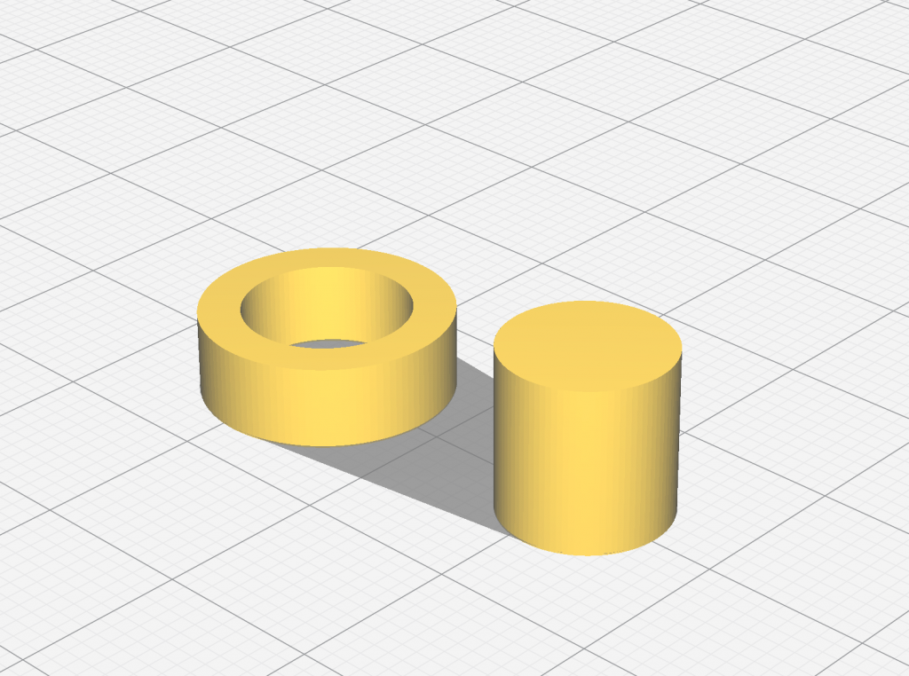

# Prueba de tolerancia

El modelo de visera que estamos imprimiendo tiene partes móviles para permitir un ajuste ergonómico al usuario final. Esto hace necesario que tengamos capacidad de imprimir tolerancias pequeñas con nuestra impresora.

Para hacer más fácil esta calibración de tolerancia podemos utilizar este modelo para hacer las pruebas de forma rápida y gastando poco filamento.

Las instrucciones a continuación aplican a Cura en la versión 4.5. Si alguno de los parámetros no te aparecen en Cura, haz click en la rueda dentada que aparece en el menú desplegable de esa categoría de parámetros y se abrirá la ventana de configuración. Allí verás todos los parámetros disponibles, sólo debes escribir el que necesitas y habilitarlo.

## Z Seam

Lo primero es configurar las costuras de la impresora (z seam). Estos parámetros le dicen a la impresora donde hacer el salto entre una capa y otra, y es posible configurar donde se hará el salto para que la pieza quede mejor.

* En la sección «Shell» (Perímetro) ajustar el valor de «Z Seam Alignment» a «User Specified»
* Ajustar «Z Seam Position» en «Back»
* La opción «Seam Corner Preference» en «Hide Seam»

## Expansión horizontal

Para evitar que las piezas móviles de la visera se fusionen seguramente necesitas ajustar la expansión horizontal. Imprime inicialmente una prueba del modelo de control de flujo con tus valores predeterminados. Si las dos piezas conectan con mucha holgura necesitarás un valor positivo en este campo (ejemplo: 0.5). Si es difícil encajarlas o directamente no entran una en la otra, necesitarás un valor negativo.

Este valor también se encuentra dentro de la sección «Shell» (Perímetro) en Cura.

Muchas gracias a Leo Cardinale en Telegram por su ayuda para crear esta guía!